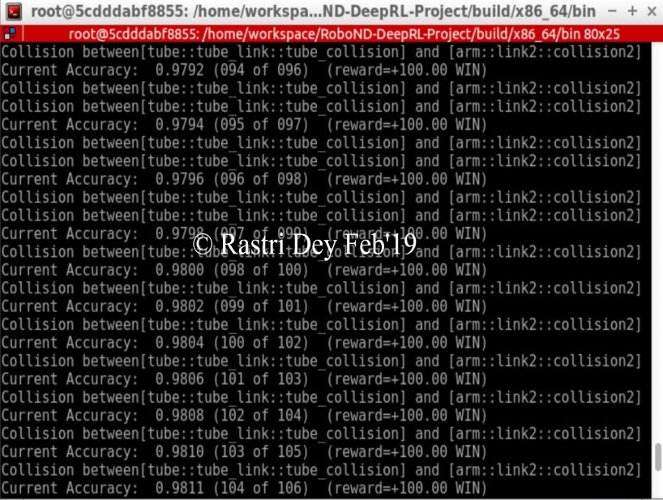
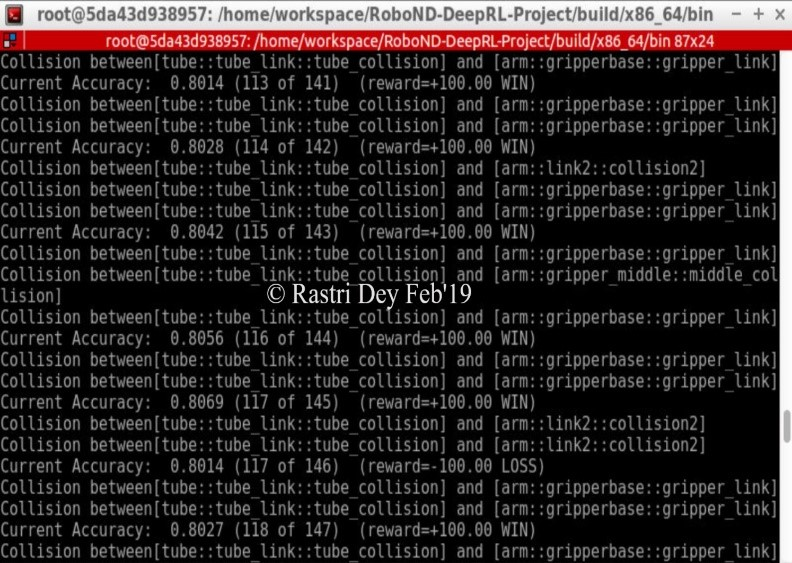
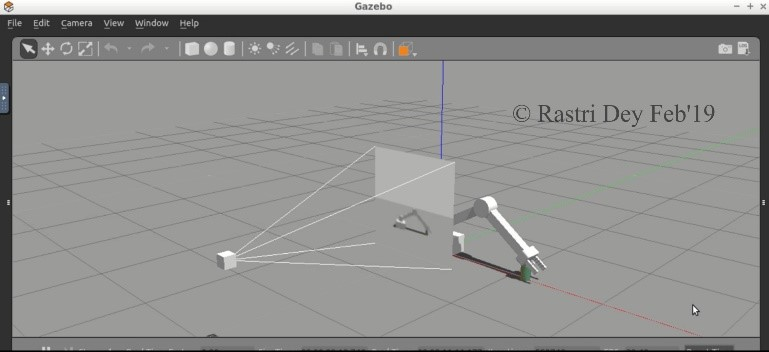

# RoboND_Deep_RL_Arm_Manipulation

Welcome to the Deep RL Arm Manipulation project! For this project, the goal is to create a DQN agent and define reward functions to teach a robotic arm to carry out two primary objectives:
1. Have any part of the robot arm touch the object of interest, with at least a 90% accuracy.
2. Have only the gripper base of the robot arm touch the object, with at least a 80% accuracy.

## Project Content

The environment built to accomplish the robotic tasks consists of a Gazebo world with the following components: 
• The robotic arm with a gripper attached to it. 
• A camera sensor, to capture images to feed into the DQN.  
• A cylindrical object or prop.  

The robotic arm model constructed in the gazebo-arm.world file, calls upon a gazebo plugin called ArmPlugin, responsible for creating the DQN agent and training it to learn, to touch the prop. The DQN agent and its learning parameters are defined in the ArmPlugin.cpp file, located in the gazebo folder in the project directory. The reward functions are created and assigned in the ArmPlugin.cpp file in the following categories: 

REWARD WIN = +100
REWARD LOSS = -100
INTERIM_REWARDS = Based on Robotic arm's proximity with the prop

The optimizer used is ``RMSprop`` with ``LEARNING_RATE 0.1f`` for Objective 1 and ``LEARNING_RATE 0.01f`` for Objctive 2.

## Project Launch

To launch the project for the first time, run the following in the terminal of the desktop gui:

```
$ cd /home/workspace/RoboND-DeepRL-Project/build/x86_64/bin
$ ./gazebo-arm.sh
```

## Results

The results for task 1 are 98% accuracy within 100 runs:


The results for task 2 are 80% accuracy within 118 runs:


The Robotic Arm hitting the Prop can be represented as:


And there goes the Deep RL agent, the robotic arm learning to grab the prop all by its own !!